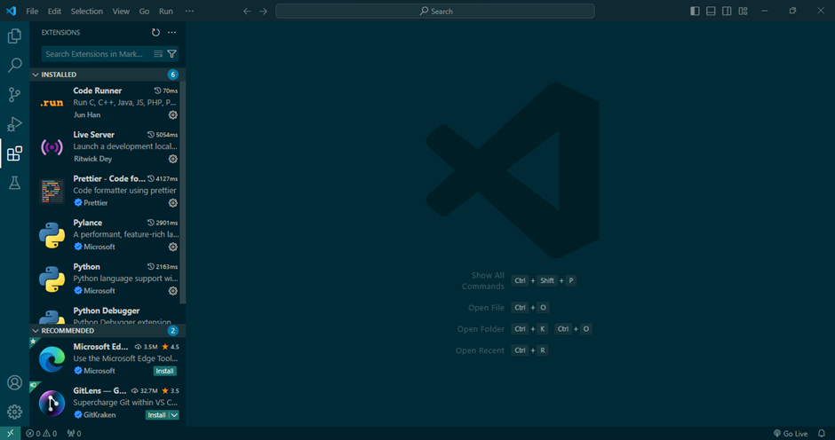

# Dev_Setup
Setup Development Environment

#Assignment: Setting Up Your Developer Environment

#Objective:
This assignment aims to familiarize you with the tools and configurations necessary to set up an efficient developer environment for software engineering projects. Completing this assignment will give you the skills required to set up a robust and productive workspace conducive to coding, debugging, version control, and collaboration.

#Tasks:

1. Select Your Operating System (OS):
   Choose an operating system that best suits your preferences and project requirements. Download and Install Windows 11. https://www.microsoft.com/software-download/windows11

Downloading and Installing Windows 11
Step 1: Preparing for the Upgrade
1.	Check System Requirements
Ensure your PC meets the minimum system requirements for Windows 11.
2.	Backup Important Data
Back up all important files and data to an external drive or cloud storage.
3.	Ensure Windows 10 is Updated
Make sure your Windows 10 installation is up to date.
Go to Settings > Update & Security > Windows Update and check for updates.

Step 2: Download and Install Windows 11
1.	Open Windows Update
Go to Settings > Update & Security > Windows Update.
2.	Check for Updates
Click on "Check for updates". If Windows 11 is available for your device, you’ll see an option to download and install it.
3.	Download Windows 11
Click "Download and install" under the Windows 11 section.

4.	Accept License Terms
Read and accept the license terms.
5.	Start Installation
Click "Install" to begin the installation process.

Step 3: Installation Process
1.	Downloading
Windows will start downloading the necessary files for the upgrade. This might take some time depending on your internet connection speed.
2.	Installing
Once the download is complete, the installation will begin. Your PC will restart several times during this process.
3.	Windows 11 Out-of-Box Experience (OOBE)
After the installation, you'll go through the initial setup process similar to setting up a new PC.

Step 4: Setup
1.	Sign In with Microsoft Account
Sign in with your Microsoft account. If you don’t have one, create a new account.
2.	Privacy Settings
Choose your privacy settings and click "Next".
3.	Setup Preferences
Follow the prompts for device customization, such as setting up OneDrive and linking your phone.
4.	Wait for Setup to Complete
Windows will finalize your settings, apps, and preferences. This might take a few minutes.
5.	Welcome to Windows 11
Once the setup is complete, you'll be greeted with the Windows 11 desktop.

2. Install a Text Editor or Integrated Development Environment (IDE):
   Select and install a text editor or IDE suitable for your programming languages and workflow. Download and Install Visual Studio Code. https://code.visualstudio.com/Download

Downloading and Installing Visual Studio Code
Step 1: Download Visual Studio Code
1.	Visit the VS Code Website
Go to the https://code.visualstudio.com/Download

2.	Download Installer: Click on the "Download for Windows" button to download the VS Code installer.

Step 2: Install Visual Studio Code
1.	Run the Installer
Once the installer is downloaded, open the .exe file to start the installation.
2.	Accept License Agreement
Read and accept the license agreement, then click "Next".

3.	Select Destination Folder
Choose the destination folder where you want to install VS Code, then click "Next".

4.	Select Start Menu Folder
Choose the Start Menu folder where you want to create the program's shortcuts. You can leave the default or specify a custom folder. Click "Next".

5.	Select Additional Tasks
•	Create a desktop icon
Check this box if you want a desktop shortcut.

•	Add to PATH: Ensure the "Add to PATH" option is checked. This allows you to run VS Code from the command line.

•	Open with Code

Check both "Open with Code" options to add context menu entries for files and directories.

•	Register Code as an editor for supported file types: Check this box to use VS Code as the default editor for certain file types.

6.	Install
Click "Install" to begin the installation.

7.	Launch Visual Studio Code
After the installation is complete, check the "Launch Visual Studio Code" box and click "Finish".

Step 3: Setup
1.	Welcome Screen
When you first open VS Code, you'll see the Welcome screen. Here you can start a new file, open a folder, or customize your settings.

2.	Install Extensions:
•	Open Extensions View: Click on the Extensions icon in the Activity Bar on the side of the window or press Ctrl+Shift+X.

•	Search and Install: Search for extensions you need (e.g., Python, JavaScript, Git, etc.) and click "Install" to add them to VS Code.

3.	Customize Settings
•	Open Settings
Go to File > Preferences > Settings or press Ctrl+,.

•	Adjust Preferences
Customize your editor settings, such as themes, font size, line numbers, etc.

3. Set Up Version Control System:
   Install Git and configure it on your local machine. Create a GitHub account for hosting your repositories. Initialize a Git repository for your project and make your first commit. https://github.com

Downloading and Installing Git
Step 1: Download Git
1.	Visit the Git Website
Go to the https://git-scm.com/download/win
2.	Download Installer
Click on the "Download for Windows" button. This should automatically start the download for the latest version of Git for Windows.

Step 2: Install Git
1.	Run the Installer
Once the installer is downloaded, open the .exe file to start the installation.

2.	Select Destination Location
Choose the destination location where you want to install Git. The default location is usually fine. Click "Next".

3.	Select Components
•	Additional icons
Check "On the Desktop" if you want a desktop shortcut.

•	Windows Explorer integration: Ensure both "Git Bash Here" and "Git GUI Here" are checked to add context menu entries.

•	Git LFS (Large File Support): Check this if you need support for large files.

•	Associate .git configuration files with the default text editor*: Check this if you want to associate .git configuration files with your default text editor.

•	Associate .sh files to be run with Bash: Check this if you want .sh files to be run with Git Bash.

4.	Select Start Menu Folder
Choose the Start Menu folder where you want to create the program's shortcuts. You can leave the default or specify a custom folder. Click "Next".

5.	Choosing the Default Editor Used by Git
Select the default editor you want to use with Git. You can choose Visual Studio Code if you have it installed, or any other text editor. Click "Next".

6.	Adjusting Your PATH Environment
Choose "Git from the command line and also from 3rd-party software" to allow Git to be used from the command line and other programs. Click "Next".

7.	Choosing the SSH Executable
Select "Use bundled OpenSSH". Click "Next".

8.	Choosing HTTPS Transport Backend
Choose "Use the OpenSSL library". Click "Next".

9.	Configuring the Line Ending Conversions
Select "Checkout Windows-style, commit Unix-style line endings". Click "Next".

10.	Configuring the Terminal Emulator to Use with Git Bash
Choose "Use MinTTY (the default terminal of MSYS2)". Click "Next".

11.	Choose the Default Behaviour of Git Pull
Choose "Default (fast-forward or merge)". Click "Next".

12.	Choose a Credential Helper
Select "Git Credential Manager". Click "Next".

13.	Configuring Extra Options
Enable file system caching: Check this.

14.	Configuring Experimental Options
Uncheck the box if you do not want to enable experimental options. Click "Install" to start the installation process.

Step 3: Complete Installation
Finish Installation
Once the installation is complete, check "Launch Git Bash" and click "Finish".

Step 4: Setup
1.	Open Git Bash
If not already open, you can open Git Bash by searching for it in the Start Menu or using the desktop shortcut.
2.	Verify Installation
To verify that Git is installed correctly, open Git Bash and run:
git --version

3.	Configure Git
Set your username and email. These settings will be used for commits.

Step 5: Setting up GitHub account

Step 6: Initializing a Git repository for your project and making your first commit
Step 1: Create a New Repository on GitHub
1.	Visit GitHub
Go to https://github.com/ and log in to your account.
2.	Create a New Repository
•	Click on the "+" icon in the upper-right corner of the page.
•	Select "New repository" from the dropdown menu.
•	Fill in the repository details:
	Repository name
Choose a name for your repository.
   Description
(Optional) Add a description of your project.
	Public/Private
Choose whether your repository will be public or private.

•	Initialize the repository
Check the box "Initialize this repository with a README" if you want to start with a README file.
	Optionally, you can add a .gitignore file and a license.
	Click the "Create repository" button.

Step 2: Initialize a Local Git Repository
1.	Open Git Bash
Open Git Bash or your preferred terminal.

2.	Navigate to Your Project Directory

3.	Initialize Git
Run the following command to initialize a Git repository in your project directory:
git init

4.	Check Status
Use “git status” to see the current state of your repository and confirm that everything is set up correctly.

5.	Add Files to the Repository

6.	Commit the Files: Commit the added files with a message

Step 3: Connect the Local Repository to GitHub
1.	Copy the Repository URL
Go to your GitHub repository page and copy the repository URL. 
2.	Add Remote Repository
Run the following command to add the GitHub repository as a remote:
git remote add origin https://github.com/username/repository-name.git

3.	Push your local repository to GitHub

Git Repository: https://github.com/G-ndanu/test.git

4. Install Necessary Programming Languages and Runtimes:
  Install Python from http://wwww.python.org programming language required for your project and install their respective compilers, interpreters, or runtimes. Ensure you have the necessary tools to build and execute your code.

Downloading and Installing Python
Downloading
1.	Visit the Python Website
Go to the official Python website at python.org.

2.	Navigate to Downloads: Click on the "Downloads" tab in the top navigation menu.

3.	 Choose Python Version
Select the latest stable version of Python that is suitable for your operating system (Windows, macOS, or Linux).

4.	Download Installer
Click on the download link for the installer corresponding to your operating system. 

Installing
1.	Run Installer
Locate the downloaded .exe file and double-click it to run the installer.
2.	Setup Wizard
•	Select Install Now
Choose the default installation option "Install Now".

•	Optional Settings
You may customize the installation by selecting "Customize installation" if needed.
3.	Add Python to PATH
•	Check the box that says "Add python.exe to PATH". This will make it easier to run Python from the command line.

•	Click on "Install Now" to begin the installation.

4.	Wait for Installation
The installer will now install Python on your system. This may take a few moments.

5.	Complete Installation
Once the installation is complete, you will see a screen that says "Setup was successful". Click "Close" to exit the installer.

6.	Verify Installation
Open Command Prompt (CMD) or PowerShell and type python --version to verify that Python has been installed correctly. You should see the version number of Python that you installed.

5. Install Package Managers:
   If applicable, install package managers like pip (Python).

Installing and Verifying pip
Step 1: Check if pip is already installed
1.	Open Command Prompt or Terminal
•	On Windows, open Command Prompt.

2.	Check pip Version
If pip is installed, this command will display the installed version of pip

6. Configure a Database (MySQL):
   Download and install MySQL database. https://dev.mysql.com/downloads/windows/installer/5.7.html

Downloading and Installing MySQL
Step 1: Download MySQL Installer
1.	Visit the MySQL Community Downloads Page
Go to the official MySQL Community Downloads page
MySQL Community Downloads.

2.	Select MySQL Installer for Windows:
•	Choose the MySQL Installer appropriate for your operating system. 

3. After selecting a version, you are provided with the option of signing up for a MySQL Community account. If you are not interested, select the No thanks, just start my download option at the bottom of the page.

Step 2: Running MySQL Installer
1.	Run the MySQL Installer
•	Once the download is complete, locate the downloaded installer file (e.g., mysql-installer-community-<version>.msi) and double-click to run it.

2. Choose Setup Type
•	When prompted to select the setup type, if "Server Only" is the only option available, select it.
•	Click "Next" to proceed.

3. Click Execute to begin the installation process.

Step 3: Configuring MySQL Server 
1. Initiate the process of configuration by clicking "Next".

2. In the Type and Networking Section, choose Development Computer, then select Show Advanced and Login Options and Click "Next". 

3. Use the recommended Strong Password Encryption on Authenitication Method and Click "Next".

4. Setup Password and Click "Next".

5. Use the default options on the Windows Service tab and Click "Next".

6. Retain default option on the Server File Permissioms and Click "Next".

7. On the logging options tab, select Slow Query Log and Binary Log and Click "Next".

8. On the Apply Configuration tab, leave everything on default and click "Execute". 

9. Click Finish when done executing.

10. On the Product Configuration tab, click "Next". 

11. Click copy log to clipboard on the installation complete tab then click Finish.

Step 4: Start MySQL Server on Windows then stop it

Step 5: Accessing MySQL
Open Command Line Client by clicking Run as administrator, you'll be prompted to enter your password.

Step 6: Proceed with whatever tasks required to be executed after acquiring access, such as accessing previously created databases.

7. Set Up Development Environments and Virtualization (Optional):
   Consider using virtualization tools like Docker or virtual machines to isolate project dependencies and ensure consistent environments across different machines.

8. Explore Extensions and Plugins:
   Explore available extensions, plugins, and add-ons for your chosen text editor or IDE to enhance functionality, such as syntax highlighting, linting, code formatting, and version control integration.

9. Document Your Setup:
    Create a comprehensive document outlining the steps you've taken to set up your developer environment. Include any configurations, customizations, or troubleshooting steps encountered during the process. 

#Deliverables:
- Document detailing the setup process with step-by-step instructions and screenshots where necessary.
- A GitHub repository containing a sample project initialized with Git and any necessary configuration files (e.g., .gitignore).
- A reflection on the challenges faced during setup and strategies employed to overcome them.

Challenges faced during setup and strategies employed to overcome them
1. Visual Studio Code
During the installation of Visual Studio Code, I encountered the challenge of customizing the setup to include specific start menu folders and associate file types with the editor. Initially, these options weren't clearly presented in the installation wizard, requiring me to carefully navigate through the settings to ensure these customizations were applied correctly.

Strategies Employed
To overcome this challenge, I followed these strategies:
•	Thorough Exploration: I thoroughly explored each screen of the installation wizard to find options for customizing start menu folders and file associations.
•	Online Documentation: I referred to online documentation and user forums to clarify any ambiguities in the installation process.
•	Manual Configuration: When necessary, options weren't readily available in the wizard, I manually configured the settings post-installation by navigating through Visual Studio Code's preferences.

2. MySQL Installation
During MySQL installation, the primary challenge was understanding and adapting to the available installer options. Specifically, the installer only offered a "Server Only" option without additional tools like MySQL Workbench, which I initially anticipated having as part of the installation package.

Strategies Employed
To manage this challenge effectively, I utilized the following strategies:
•	Installation Adaptation: I adjusted my installation approach to focus on configuring MySQL Server without the additional tools included in the primary installer.
•	Supplementary Tool Installation: Recognizing the absence of MySQL Workbench, I separately downloaded and installed it from the MySQL website to complement MySQL Server's functionalities.
•	Verification of Functionality: Post-installation, I verified MySQL Server's functionality by creating databases, executing queries, and ensuring connectivity through MySQL Workbench.

#Submission:
Submit your document and GitHub repository link through the designated platform or email to the instructor by the specified deadline.

#Evaluation Criteria:**
- Completeness and accuracy of setup documentation.
- Effectiveness of version control implementation.
- Appropriateness of tools selected for the project requirements.
- Clarity of reflection on challenges and solutions encountered.
- Adherence to submission guidelines and deadlines.

Note: Feel free to reach out for clarification or assistance with any aspect of the assignment.
